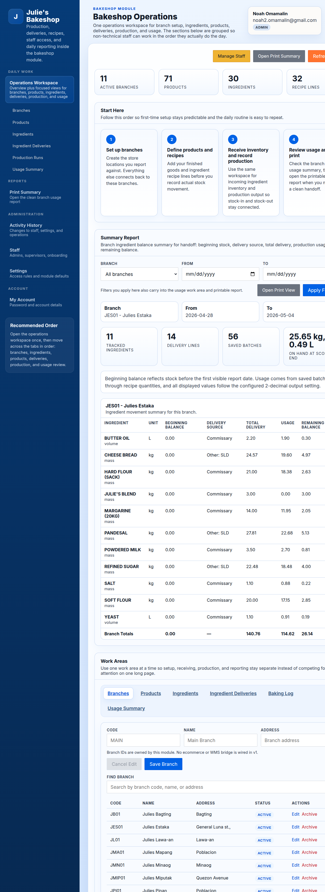
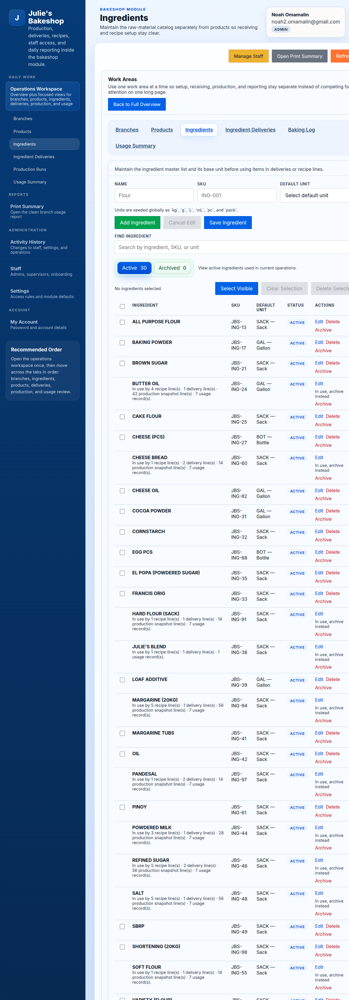
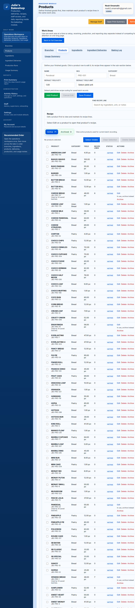
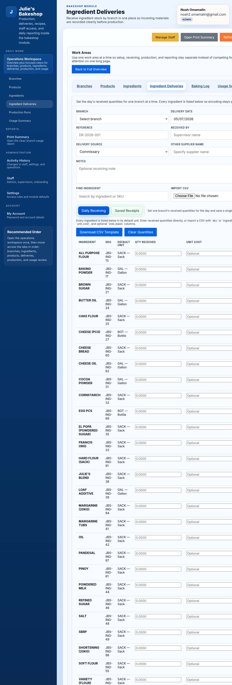
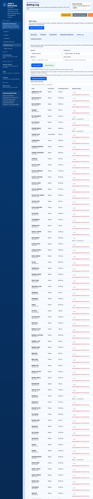
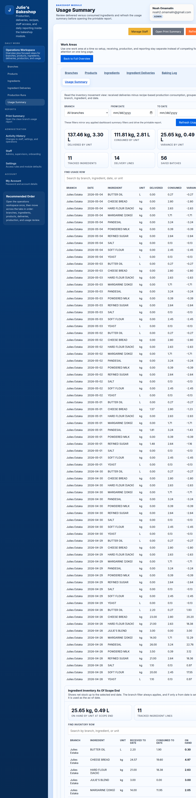

# Bakeshop Workspace User Guide

This guide is for Bakeshop admins and supervisors who work inside the day-to-day operations pages. It focuses on the actual workspaces used to set up branches, manage ingredients and products, record deliveries and production, and review usage.

Screenshots in this guide were captured from the Julie's Bakeshop reference tenant on 2026-05-07. Your branch counts, product counts, and table contents will vary by tenant.

## 1. Workspace Overview

The main Bakeshop landing page is the **Operations Workspace**. It gives you:

- the left sidebar for moving between work areas
- the topbar with the signed-in user card and sign-out action
- summary counts for branches, products, ingredients, and recipe lines
- quick actions for **Manage Staff**, **Open Print Summary**, and **Refresh Data**
- the recommended work order for setup and daily execution

### What to pay attention to first

Use the workspace in this order when setting up a tenant or training a new operator:

1. **Branches**: create the store locations you report against.
2. **Ingredients**: define your raw materials and their units.
3. **Products**: define finished goods and connect recipe lines.
4. **Ingredient Deliveries**: record incoming ingredient stock.
5. **Baking Log**: record what was produced.
6. **Usage Summary**: review the resulting ingredient movement and balances.

This order keeps branch setup, inventory receiving, production, and reporting aligned with how the bakery actually works during the day.

## 2. Ingredients Workspace

Use the **Ingredients** page to maintain the ingredient master list used by deliveries, recipes, and usage reporting.

### What operators do here

- Add a new ingredient with the correct unit of measure.
- Search the ingredient list before creating a duplicate record.
- Open an existing ingredient for editing when a name, unit, or other detail needs to be corrected.
- Review the workspace list to confirm which ingredients are active and available for operations.

### Practical guidance

- Treat this page as the source of truth for raw materials.
- Set up ingredients before building recipes, otherwise products cannot be mapped cleanly.
- When editing an ingredient, finish the edit or cancel it before starting another record so the form state stays clear.

## 3. Products Workspace

Use the **Products** page to define what the bakery produces and sells. This workspace is where finished goods and recipe structure come together.

### What operators do here

- Create finished products.
- Review the products table and search for existing records.
- Open a product to update its details.
- Maintain recipe lines so ingredient usage can be calculated later.

### Practical guidance

- Set up products only after the ingredient list is ready.
- Keep product names and recipe contents consistent, because the usage report depends on those recipe relationships.
- Use editing for corrections and use new-record mode only when you are creating a genuinely new product.

## 4. Ingredient Deliveries Workspace

Use the **Ingredient Deliveries** page to record incoming raw materials before those materials are consumed by production.

### What operators do here

- Record received ingredient stock.
- Tie deliveries to the correct branch and date.
- Review saved delivery lines for accuracy.
- Correct a delivery entry before it affects later reporting.

### Practical guidance

- Record deliveries before logging production whenever possible.
- Use the same branch and date conventions consistently so reports are easier to verify later.
- Review received quantities carefully because they feed directly into usage and remaining-balance calculations.

## 5. Baking Log Workspace

Use the **Baking Log** page to record production runs. This is the production-side workspace for the bakery team.

### What operators do here

- Choose the branch and production date.
- Review the available products and standard batch references.
- Enter the quantity finished for each product that was produced.
- Save production records so the system can calculate ingredient consumption.

### Practical guidance

- Record production only after product recipes are correct.
- Match the branch and date to the real production event.
- Use this page as the authoritative production record rather than keeping separate unofficial tallies.

## 6. Usage Summary Workspace

Use the **Usage Summary** page to review ingredient movement after deliveries and production have been recorded.

### What operators do here

- Filter the report by branch and date range.
- Review beginning balance, delivery totals, usage, and remaining balance.
- Validate whether the ingredient movement matches expected bakery activity.
- Open the print-friendly handoff from the same reporting flow.

### Practical guidance

- Use this page after deliveries and production are already encoded.
- Check unusual balances first; they usually point to a missing delivery, an incorrect recipe line, or a production run that was not saved correctly.
- Use the same filters here that you expect to use in the printable summary so the handoff stays consistent.

## 7. Supporting Pages Around the Workspaces

The left sidebar also includes pages that support the operations workspaces:

- **Print Summary**: opens the cleaner printable version of the branch usage report.
- **Activity History**: reviews changes to staff, settings, and operations.
- **Staff**: manages admin and supervisor accounts.
- **Settings**: controls module defaults and access rules.
- **My Account**: lets the signed-in user update their own password and account details.

These pages support the workspace flow, but the daily operating cycle normally stays centered on **Ingredients**, **Products**, **Ingredient Deliveries**, **Baking Log**, and **Usage Summary**.

## 8. Suggested Training Sequence

For onboarding a new Bakeshop operator, train in this order:

1. Show the **Operations Workspace** and sidebar navigation.
2. Demonstrate how ingredients are created and searched.
3. Demonstrate how products and recipes connect to ingredients.
4. Demonstrate how ingredient deliveries are entered.
5. Demonstrate how production is logged in **Baking Log**.
6. End in **Usage Summary** so the operator sees how the previous steps affect reporting.

That sequence teaches the whole workflow from setup to reporting instead of treating each page as an isolated screen.